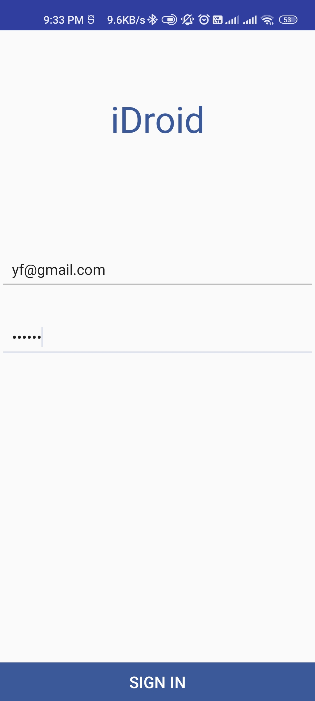

##iDROID
Peer to Peer Chat Application which can also be used by colour blind and partially blind people.

Used Google text-to-speech and speech-to-text APIs for providing sound as feedback for incoming and outgoing text messages. 

Used Firebase for following services
* [Notification Services] 
* [Messaging Services] 
* [Database Service]

## Screenshots

